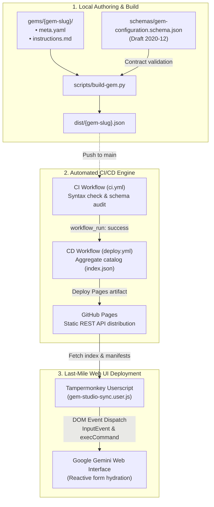

# gem-studio 💎

[](https://github.com/rmasabela/gem-studio/actions/workflows/ci.yml)
[](https://github.com/rmasabela/gem-studio/actions/workflows/deploy.yml)
[](LICENSE)
[](schemas/gem-configuration.schema.json)

> A modular engineering framework for authoring, validating, SemVer-versioning, and continuously deploying Google Gemini Gems under **Prompt-as-Code** and **Docs-as-Code** paradigms.

---

## 📖 Overview

**gem-studio** brings software engineering rigor to Google Gemini assistant development. It shifts Gem authoring away from ad-hoc, untracked browser prompt boxes into an auditable, version-controlled pipeline.

By treating every Gem as an immutable, testable code artifact, this repository establishes:

1. **Contract-Driven Development**: Schema validation powered by JSON Schema Draft 2020-12.

1. **Automated CI/CD Workflows**: Linting, schema compliance verification, dynamic catalog indexing, and distribution via GitHub Pages.

1. **Last-Mile Synchronization**: An automated browser Userscript that applies version-controlled prompts and settings directly to the Gemini Web UI with zero copy-paste fatigue.

---

## 🏗️ Repository Architecture

```text
gem-studio/
├── schemas/
│   └── gem-configuration.schema.json     # Formal contract (JSON Schema Draft 2020-12)
├── gems/
│   ├── _template/                         # Standard boilerplate template for new Gems
│   │   ├── meta.yaml                      # Declarative configuration and tool metadata
│   │   └── instructions.md                # System instructions & conversational topology
│   ├── vault-distiller/                   # Docs-as-Code curator for terminal & Obsidian
│   │   ├── meta.yaml                      # SemVer version, capabilities, and parameters
│   │   └── instructions.md                # Multi-phase master system prompt
│   └── spec-crafter/                      # Hardware auditing and technical specs curator
│       ├── meta.yaml
│       └── instructions.md
├── scripts/
│   └── build-gem.py                       # CLI compiler & validator (PyYAML + jsonschema)
├── .github/workflows/
│   ├── ci.yml                             # CI pipeline: syntax validation and artifact builds
│   └── deploy.yml                         # CD pipeline: catalog compilation to GitHub Pages
├── integrations/tampermonkey/
│   └── gem-studio-sync.user.js            # In-browser sync engine for Gemini web app
├── LICENSE                                # MIT License
└── README.md
```

---

## ⚙️ Core Architecture & Design

### 1. Formal Schema Contract (`schemas/gem-configuration.schema.json`)

Every Gem must strictly adhere to the `GemConfigurationSchema`:

* **`metadata`**: `name`, `description`, `version` (SemVer), and `author` (Ricardo Masabel).
* **`behavior`**: `instructions` (compiled system prompt) and `tone_and_style`.
* **`tools`**: `default_tool` (e.g., `none`, `web_search`) and active `extensions`.
* **`knowledge_base`**: Declarative inventory of grounding documentation and reference assets.

### 2. Modular Gem Structure

Each assistant lives in its own directory under `gems/{gem-slug}/`:

* **`meta.yaml`**: Pure metadata and operational parameters decoupled from prompt prose.
* **`instructions.md`**: The master prompt containing behavioral guardrails, workflow stages, and output formatting schemas.

### 3. Local Compiler (`scripts/build-gem.py`)

Merges `meta.yaml` and `instructions.md`, validates the assembled payload against the schema contract, and compiles a standalone JSON release manifest in `dist/`.

```bash
# Activate your virtual environment
source .venv/bin/activate  # Or: Activate.ps1 on Windows

# Validate and compile a Gem
python scripts/build-gem.py gems/vault-distiller

```

---

## 🚀 End-to-End Pipeline & Integration



### CI/CD Pipeline

* **Continuous Integration (`ci.yml`)**: Triggered on every commit and pull request. Validates all gems in `gems/` to ensure no schema regressions are introduced.
* **Continuous Delivery (`deploy.yml`)**: Compiles each release artifact, aggregates an index manifest (`dist/index.json`), and publishes the bundle to **GitHub Pages** (`https://rmasabela.github.io/gem-studio/`).

### Last-Mile Sync Engine (Tampermonkey Userscript)

To bridge Git releases with the Gemini web interface:

1. Install [Tampermonkey](https://www.tampermonkey.net/) in your browser.
2. Load the script from `integrations/tampermonkey/gem-studio-sync.user.js`.
3. Open the Gem creation or edit interface on [gemini.google.com](https://gemini.google.com).
4. Use the bottom-right floating **GEM-STUDIO** dock to select your Gem and click **Deploy to UI**. The script updates the native reactive text fields and rich text instructions via DOM event dispatching.

---

## 🛠️ Getting Started

### Prerequisites

* Python 3.10+
* Git

### Local Setup

```bash
git clone https://github.com/rmasabela/gem-studio.git
cd gem-studio

python3 -m venv .venv
source .venv/bin/activate  # On Windows: .\.venv\Scripts\Activate.ps1
pip install -r requirements.txt

```

### Authoring a New Gem

1. Scaffold from template:

```bash
cp -r gems/_template gems/my-new-gem

```

2. Configure parameters in `gems/my-new-gem/meta.yaml`.

3. Write system prompts and output schemas in `gems/my-new-gem/instructions.md`.
   
4. Validate and build locally:
   
```bash
python scripts/build-gem.py gems/my-new-gem

```

---

## 📄 License

This project is open-source software licensed under the terms of the [MIT License](LICENSE).

**Author**: [Ricardo Masabel](https://github.com/rmasabela)
